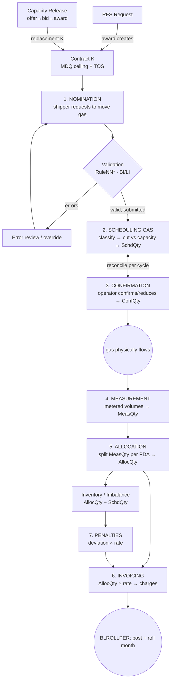

# QPTM Application — Complete Lifecycle & Understanding Guide

> A single document to *understand* QPTM end-to-end: what it is, how it's built, the full
> gas-day transaction lifecycle stage-by-stage, the data/batch maps, and hands-on exercises.
> Synthesized from the in-repo AI Agent Help Docs (`ai_help_docs/`, 47 files) + the L4
> `SKILL_*.md` files + `QPTM_SCREEN_INFO/`. Read alongside [00_STUDY_GUIDE.md](00_STUDY_GUIDE.md).

**Table-name caveat (read once):** table names below are as stated in the source docs. Several
have known naming drift (`NNCTRL_NOM_*`, `PACTRL_LOC*`, `NNCTRL_CTR_PREF`). Verified live names
include `EDTRAN_TRANSACTION`, `NNCTRL_ACTV_DTL`, `QCTRL_VALD_RULE`, `EDCTRL_TPA_HDR`,
`PACTRL_CYCLE_DEADLINE`, `PACTRL_CYCLE`. **Always confirm a physical name against the DAL CodeGen
before quoting it to Engineering or running production SQL.**

---

## Part 1 — What QPTM Is

**QPTM (Pipeline Transaction Management)** — marketed as *"My Quorum Gas Pipeline"* — runs an
interstate natural-gas **transportation pipeline**. Shippers contract for capacity, nominate gas
to move on a given day, the pipeline confirms with operators and schedules flow against physical
capacity, actual volumes are measured and allocated back to contracts, and everything is invoiced
— all inside NAESB-standard timing windows called **cycles**. The organizing unit is the **gas day**.

### The cast of characters

| Actor | Role | Keyed by |
|---|---|---|
| **TSP** (Transportation Service Provider) | The pipeline company. Scopes *everything*. | `TspNo` |
| **Shipper** (Service Requester / Business Associate) | Contracts for capacity, nominates gas | `SrBpNo` / `BpNo` (DUNS) |
| **Operator** | Runs a physical point; confirms what will flow | location contact `OPR`/`CNF` |
| **Replacement shipper** | Wins released capacity via Capacity Release | new replacement contract |

### The core vocabulary (learn these five first)

- **Contract (K)** — the agreement granting transport/storage rights. Carries the **MDQ** ceiling and a **TOS**.
- **MDQ** (Maximum Daily Quantity) — the daily capacity ceiling. Everything downstream is bounded by it.
- **TOS** (Type of Service) — the *kind* of service (firm transport, interruptible, park-and-loan, storage…). Drives which rules, rates, tabs, and attributes apply. **The single most important field on a contract.**
- **Gas Day** — a 24-hour TSP-defined period (typically 9 AM CT → 9 AM CT).
- **Cycle** — a nomination/scheduling window within the gas-day timeline (Timely, Evening, ID1, ID2, ID3), each with **deadlines**.

---

## Part 2 — System Architecture

### 2.1 Two UIs over one middle tier

```
        myQuorum WEB                         ClassicGUI (C++/MFC, Citrix)
   .NET 4.8 / ASP.NET MVC / Kendo        legacy MFC screens + modern SOA screens
   operational screens (noms, conf,      most CONFIG/maintenance screens
   CR, RFS) — READS/executes config      (Cycles, Validation Rules, EDI defs) — WRITES config
        │                                         │
        │   legacy MFC = direct SQL  ─────────────┤
        └───────────────┬─────────────────────────┘
                        ▼   (SOA screens + Web both call the same WCF middle tier)
                 WCF QPTM Middle Tier
```
**Rule of thumb:** Web *executes* configuration at runtime; Classic *writes* much of it. A config
screen "not on Web" is usually **expected** — it's a Classic-only maintenance screen.

### 2.2 The layer cake

```
┌───────────────────────────────────────────────────────────────────────┐
│ PRESENTATION    Web: MVC controller + UIController(UIC) + RootVM        │
│                 Classic: QVp* screens (MFC) / QCntl* (SOA WinForms)     │
├───────────────────────────────────────────────────────────────────────┤
│ WCF ServiceClient   QPTMServiceClient : QServiceClientChannelBase       │
├───────────────────────────────────────────────────────────────────────┤
│ MIDDLE TIER ("QPEC")   Quorum.QPTM.ServiceCore*                         │
│   ├─ Service facades   (thin ServiceHelper.Execute wrappers)            │
│   ├─ Validation        Quorum.QPTM.Validations.Rules.* (RuleNN*, RuleCR*)│
│   ├─ Events            QICService.NotifyOfChange (inter-module)         │
│   └─ Batch launch      IQProcessLauncherService (BATCHID_*)             │
├───────────────────────────────────────────────────────────────────────┤
│ DATA OBJECTS    BaseDO / *CompleteDO ; DataObjectState Added/Mod/Del    │
├───────────────────────────────────────────────────────────────────────┤
│ DATA ACCESS (DAL, CodeGen)  →  Oracle / SQL Server                      │
└───────────────────────────────────────────────────────────────────────┘
```
**Hard rule** (`Directory.Build.targets`): presentation code must **never** touch the DAL — every
path is UI → WCF → ServiceCore → Validation/DAL. So when tracing any bug, the route is always the same.

### 2.3 Web request lifecycle (browser → DB)

```
Browser (Kendo + precompiled Razor, carries QUIWebContextId)
  → ASP.NET MVC screen controller           Action / *FieldUpdate / grid endpoints
  → QWebContext UIC store                    (per-user, per-screen server-side state between requests)
  → UIC verb: PushParams → Do<Verb> → ClearParams → LogObjectMessages
  → WCF ServiceClient
  → ServiceCore (facade → core logic → validation rules → events → batch)
  → DataObject (BaseDO)
  → DAL → Oracle / SQL Server
```
The **UIController is a stateful server-side object** living between AJAX requests; every call
carries `[QUIWebContextId] id` to re-attach to it. Each screen = **MVC controller + UIC + RootVM**.

---

## Part 3 — The Foundations (what everything references)

Before a single molecule of gas moves, four things must exist. These are the **Tier 0** modules.

### 3.1 Contract (K) — the anchor object

- Agreement between a **shipper** and the **TSP**. Identified by `(TspNo, CtrNo, AmendNo)`; **effective-dated** (time slices with `EffDateFrom/To`); **amendable** (Additive = new time slices, or Replacement).
- **Status lifecycle:** `DFT → PEN → PRO → EXE → ACT → EXP` (plus `UAF/TRM/INA`). Executed requires an `ExecutedDate`.
- **Capacity quantities:**

| Term | Meaning |
|---|---|
| **MDQ** | Maximum Daily Quantity — transport ceiling (contract-level and per-location; seasonal variants) |
| **MSQ** | Maximum Storage Quantity — storage ceiling |
| **MDIQ / MDWQ** | Max Daily Injection / Withdrawal Quantity (storage) |
| **OvrdCtrMdq / SRC** | Temporary override / supplemental receipt capacity |

- **TOS attributes** (per contract, normalized `KCTRL_CTR_ATTR` + denormalized `_FLAT`): NOM (nominatable), BIL (billable), CAP (capacity-release allowed), IMB (imbalance), HNA (hourly noms), EVG (evergreen)… These drive downstream eligibility. *Flat table is resynced only on contract save — a stale flat row blocks noms/billing until re-saved.*
- **Key tables:** `SCTRL_CTR_HEADER` (base header), `SEXTN_CTR_HEADER_QPTM` (**MDQ/MSQ live here**), `KCTRL_CTR_LOC` (per-location MDQ), `KCTRL_CTR_ATTR(_FLAT)`.
- **Screen/Service:** Contract Maintenance / `QPTMServiceCore_ContractMaintenance`.

### 3.2 RFS (Request For Service) — how a contract is *born*

The **only sanctioned way a new contract enters the system.** A request is submitted, approved
through sequential departments, and **awarded** — the award creates the contract.

```
PND ─(validate)→ VLD ─(submit)→ APR ──(multi-dept approvals)──→ (award = CTR action) ─→ CRE
                  PIN(invalid)      APR → DEN(denied) / WTD(withdrawn) / AWI(award invalid)
```
- Award fires the `KRFSTOCTR` process → contract created (copies BP, TOS, locations+MDQ, negotiated rates, text, contacts).
- **Common issue:** RFS stuck in `APR` because a configured approval department never approved; or `AWI` on award due to inactive locations / rate resolution failure.

### 3.3 Locations, Paths, Segments, Zones — *where* gas moves

- **Location / meter** (`MtrNo`): every point gas enters (Receipt, POV=R), exits (Delivery, POV=D), or is measured. Effective-dated. Attributes (NOM, ALL, STR…) drive behavior.
- **Location Groups** → capacity/rate **areas**, scheduling, reporting.
- **Path** = a route between points (`PALocationPathHdr` + legs). **Nominations reference a path.**
- **Segments / Zones** = capacity tracked along the route; feed scheduling and rate-area resolution.
- **Common issue:** a location isn't nominatable → missing `NOM` attribute (or stale flat row), inactive status, or an effective-date gap for the gas day.

### 3.4 Rates — *what it costs*

- Hierarchy: **Rate Schedule** (e.g. "FT-1") → **Rate Header** (`TOC_CD`, rate type, price type, charge period, eff dates) → **Rate Detail** (per-location value).
- **TOC (Type of Charge)** = *what* is charged (reservation/demand, commodity/usage, fuel retention, surcharge). Applicability to a TOS via cross-ref rules.
- **Resolution is ranking-based** (`RateResolutionMgr.FindLowestRankingRateDetail` — lowest rank = most specific = wins): rate-type rank → **header rank** (contract-specific beats TOS-specific) → **detail rank** (specific location beats broad group). A **tie throws "Multiple rates found"**; no match → null.
- **Common issue:** "Multiple rates found" (two details resolve to identical rank) or wrong/no rate (missing detail for the gas day/location/TOC).

### 3.5 Cycles & Deadlines — the clock that gates *every* stage

- **Cycles:** Timely (1), Evening (2), ID1 (3), ID2 (4), ID3 (6).
- **Deadline categories:** NOM, CNF (confirmation), SCH (scheduling), PDA. **Types:** ONT (on-time), INT (intraday/end-of-flowday), LAT, ITI/ETI (internal/external).
- Windows configured in **`PACTRL_CYCLE_DEADLINE`** (per TSP × cycle × category × type × user-type) → resolved at runtime by **`CalcDeadline(gasDay)`**.
- **Late nomination = ENMQR315** ("cycle closed"). *EDI trap:* inbound NMST stamps the cycle under the TPA-context user but validates under the validating user, and EDI is the only channel that skips `NomCalcHelper.SplitRangeNomByOpenCycle` → **false ENMQR315 near a deadline.**

---

## Part 4 — THE END-TO-END LIFECYCLE

### 4.1 The master flow



ASCII version of the spine:

```
CONTRACT (K, MDQ)  →  NOMINATION  →  SCHEDULING(CAS) ⇄ CONFIRMATION  →  [FLOW]  →
MEASUREMENT  →  ALLOCATION  →  INVOICING (+PENALTIES)  →  POST & ROLL MONTH
       ▲                                                         │
   Capacity Release / RFS create contracts       Inventory/Imbalance runs alongside
```

> **Confirmation ↔ Scheduling coupling:** within a cycle, nominations are classified and cut to a
> preliminary **Scheduled Quantity**, operators **confirm** (which can trigger re-cuts), and the
> final scheduled quantity is issued before the next cycle. Exact ordering is TSP/config-dependent;
> treat CONF and CAS as tightly coupled within each cycle rather than strictly sequential.

### 4.2 The quantity transformation chain (the single most useful mental model)

Every stage transforms one quantity into the next. To explain *any* billed volume, walk this chain:

```
 NomQty          SchdQty           ConfQty          MeasQty          AllocQty        $ / Penalty
(requested) ──▶ (scheduled   ──▶  (operator   ──▶  (metered,   ──▶  (split per  ──▶ (rate × qty;
                 after cuts)       confirms)         actual)          PDA)            deviation×rate)
    NOM             CAS              CONF             MEAS             ALLOC           INVC / PEN

 Imbalance = AllocQty − SchdQty        Variance = NomQty − ConfQty
```

The **LifeCycle** screen (`NNCTRL_LIFECYCLE`) traces one transaction across all of these — it is the
single best diagnostic when someone asks "why did my gas / my bill come out this way?"

---

### Stage 1 — NOMINATION (NOM)

| | |
|---|---|
| **Purpose** | Shipper requests to move X Dth from a receipt point to a delivery point, under a contract, for a gas day + cycle |
| **Quantity** | produces **NomQty** (`RecQty`, `DelQty`, `FuelQty`) |
| **Entry models** | **PNT** (NAESB 3.0: path total + upstream/receipt + downstream/delivery legs; balance rule `Receipt = Delivery + Fuel`) · **PT** (legacy point-to-point) |
| **Keys** | `IdNom` (header), `NomSeqNo` (detail), scoped by `TspNo + IdCycle + BegGasDay/EndGasDay` |
| **Lifecycle** | Draft/Activity → Save → Validate → [override] → Submit → flows to CAS |
| **Validation** | 4 levels in order: **Security → Foreign Key → Line → Business** (167 rules, `RuleNN*`). **LI** (line-invalid `VALD`) = a record broke a line/FK rule; **BI** (business-invalid `INVL`) = a cross-record rule (e.g. MDQ exceeded). `BLOCK_BI_NOM_SUBMISSION` can block submit while BI errors exist |
| **Override** | Authorized users override an error through an end date; if that date < nom end, the nom is **split** into overridden + non-overridden ranges (`NNTRAN_ERROR_OVERRIDES`) |
| **Key tables** | `NNCTRL_NOM_HDR` / `_DTL` / `_DTL_ERR` / `_DTL_HRLY`, `NNCTRL_LIFECYCLE`, `NNTRAN_ERROR_OVERRIDES` *(verify names vs DAL)* |
| **Screens/Services/Batches** | Nomination Submission / Maintenance / Error Overrides · `QPTMNominationService` (`SaveActivity`, `ValidateNominations`, `SubmitNominations`) · **NNSUBMIT / NNVALIDATE** |
| **Cycle timing** | Must be within the open NOM cycle deadline for the gas day, else **ENMQR315** |
| **Common L4** | "Cycle closed" disputes → check `PACTRL_CYCLE_DEADLINE` vs gas-day start · MDQ-exceeded BI blocking submit · unexpected nom split after override (expected) |

### Stage 2 — SCHEDULING / Capacity Allocation (CAS)

| | |
|---|---|
| **Purpose** | Turn nominated+confirmed volumes into **Scheduled Quantity**, cutting when capacity is oversubscribed |
| **Quantity** | **NomQty → SchdQty** |
| **How** | classify noms into **transaction groups** (ranked) → aggregate per **scheduling object** (segment/location/group) → compare to **OAC** (Operational Available Capacity) → apply **reduction** → SchdQty |
| **Rights (priority)** | **P** Primary (never cut) → **SI** Secondary In-Path → **SO** Secondary Out-of-Path → **N** None/Overrun (cut first). MDQ = contracted max; OAC = daily physical availability; SchdQty ≤ OAC |
| **Reduction** | triggered when `Σ nominated > OAC`; **higher transaction-group rank cut first**; within a rank: pro-rata / FCFS / contract-specific / MDQ-% |
| **Key tables** | `CACTRL_SCHD_HDR` (SCEN_STAT P/S/F), `CASTAG_OBJ_NOM_TRANS_GRP` (staging), `CACTRL_SUMMARY` (final SchdQty/CutQty/OAC), `PACTRL_RULE_SET`, `PACTRL_TRANS_GRP` |
| **Screens/Services/Batches** | CAS Summary Maintenance (Query/Submit/**PrelimCut**) · `QPTMSchedulingService` · batches **NNCLASSFY** (classify) → **SCOAC**/StageOAC → **SCREDUCE** (reduce) → Summary |
| **Cycle timing** | Runs per gas-day + cycle; later cycles revise SchdQty; latest cycle wins |
| **Common L4** | Unexpected cuts → check transaction-group **rank** ordering + OAC staging (stale/zero OAC) · over-allocated primary rights → permissive location-match logic |

### Stage 3 — CONFIRMATION (CONF)

| | |
|---|---|
| **Purpose** | TSP's formal response with operators: the quantity that will actually flow |
| **Quantity** | records **ConfQty** (referencing NomQty & SchdQty). **Variance = NomQty − ConfQty** (>0 = cut, needs a **Reduction Reason**) |
| **Constraints** | `ConfQty` cannot go below **EPSQ** (minimum safety quantity); **hourly profiles** (HR_01–HR_24) must sum to daily ConfQty; **path balancing** — confirmed receipts must equal confirmed deliveries |
| **Methods** | Auto / Manual / EDI / Default; auto-confirm generates a full-confirm by rule |
| **Validation** | 4 levels (Security → FK → Line → Business); Business includes EPSQ floor, path balancing, cycle deadline |
| **Key tables** | `CFCTRL_CONF` (1 per nom per cycle), `CFCTRL_CONF_HOURLY`, `CFCTRL_CONF_LVL(_DTL)`, `CFCTRL_CONF_PLAN` |
| **Screens/Services/Batch** | Confirmation Response / Confirmation Summary · `QPTMConfirmationResponseServiceExt` · **CFPROCESS** (post-submit: variance, path balancing, EDI conf txns, notify allocations/billing) |
| **Cycle timing** | Category **CNF**; same cycle IDs; latest-cycle confirmation overrides earlier |
| **Common L4** | "Below EPSQ" rejection · unbalanced-path block on submit · hourly total ≠ daily · editing a closed-cycle confirmation needs **Edit Closed Cycle** permission |

### Stage 4 — MEASUREMENT (MEAS)

| | |
|---|---|
| **Purpose** | Record the **actual** gas measured at meter points after it flows |
| **Quantity** | produces **MeasQty** (`VolQty` MCF, `EngQty` DTH, `EngQty = VolQty × BtuFactor`) |
| **Detail** | Accuracy **A**(actual)/**E**(estimate); volume source MAN/FlowCal/MPS; **daily** vs **hourly** (24 slots roll up to daily); gas analysis → BTU factor |
| **Dates (critical)** | **Gas Day** (flowed) · **Production Month** (when flowed) · **Accounting Month** (billing period; ≥ ProdMth). `ACCTG_MTH_LAG_TIME` relates them. Closed months = read-only; move to history |
| **Key tables** | `ALCTRL_MEAS_VOL` (current), `ALCTRL_MEAS_VOL_HIST`/`ALHIST_MEAS_VOL` (closed), `PALocationAggregate` |
| **Screens/Services/Batch** | Measurement Entry / Results (read-only) · `QPTMAllocationServiceExt_Measurement` · **BATCHID_ESUITE_VOL_IMPORT** (SCADA/FlowCal import + aggregate rollup) |
| **Common L4** | Save blocked → closed accounting month, aggregate-entry config false, or Actual-record lock · missing daily total → hourly not rolled up, or bidirectional POV not set |

### Stage 5 — ALLOCATION (ALLOC)

| | |
|---|---|
| **Purpose** | Split the measured volume at a point among the contracts/shippers per the **PDA** |
| **Quantity** | **MeasQty → AllocQty**. Balance: `Σ AllocQty at a loc = MeasQty`. **Imbalance = AllocQty − SchdQty** |
| **PDA** (Predetermined Allocation) | shipper/operator doc: how to split. Header `ALTRAN_PDA_HDR` + detail `ALTRAN_PDA_DTL` (one line per contract) |
| **Methods** | **PRT** Pro-Rata (default; by SchdQty share) · **PRI** Priority (H→B→L tiers) · **PCT** Percentage (lines sum 100%) · **AMT** Amount (fixed volumes) |
| **PPA** | *Previously Posted Allocations* — immutable snapshot before reallocation; `Adjustment = new AllocQty − PPA`. Measurement changes post-post raise **PPA events** → reallocation |
| **Key tables** | `ALTRAN_PDA_HDR`/`_DTL`, `ALCTRL_ALLOC` (SCHD/ALLOC/MEAS qty), `ALTRAN_ALLOC` (audit), `ALLOC_PLAN_*` |
| **Screens/Services/Batch** | Daily/Monthly Allocated Quantity Maintenance · `QPTMAllocationService(_Ext_PDA/_Measurement/_AggregateLocation)` · **ALALLOCATE** |
| **Common L4** | Alloc ≠ measured / unexpected split → stale AllocationCache, PCT lines ≠ 100%, missing PDA · missing reallocation after a measurement fix → PPA event not generated (contract not linked to loc, or approval pending) |

### Stage 6 — INVOICING / BILLING (INVC)

| | |
|---|---|
| **Purpose** | Turn allocated/scheduled quantity into money |
| **Quantity** | **AllocQty × rate = charge** (per activity day). Hierarchy: **Header → Detail (per contract+TOC) → Sub-Detail (daily)** |
| **Charge model** | **TOC** = what's charged; **ChargeBasisCode** = basis (capacity/MDQ, commodity/usage, fuel %); **Invoice Groups** organize which contracts bill together |
| **Status** | `PRE → APP → FIN(locked) → PST(posted)` (+ MOD/SS/WO). `FIN` is immutable and required before posting |
| **Key tables** | `BLTRAN_INVOICE_HDR` / `_DTL` / `_SUB_DTL` (+ `_REV`), `BLXREF_LAST_INVOICE_GRP_RUN` (drives `IsOpen`), `BLCTRL_INVOICE_GRP(_CTR)` |
| **Screens/Services/Batch** | Invoice Maintenance (5 tabs) · Invoice Group Maintenance · `QPTMServiceCore_InvoiceMaintenance` · **BLROLLPER** (post `FIN` invoices + roll accounting month) · **BLRX00** (PDF) |
| **Common L4** | Missing/duplicate sub-details → the `BLXREF_LAST_INVOICE_GRP_RUN` join (not tied to latest run) · "can't post/change status" → already `FIN` or month closed · external user sees nothing → agent-chain filter or Internal-only group |

### Stage 7 — PENALTIES (PEN)

| | |
|---|---|
| **Purpose** | Charge shippers for deviating from scheduled quantities (over/under) |
| **Quantity** | compare **SchdQty vs AllocQty** → deviation × rate = penalty; tiered, with tolerance bands |
| **Types / basis** | `IMP` (imbalance pooling) · `CPD`/`CPR` (critical-period delivery/receipt); basis **AL** (location group) or **IN** (inventory accounts) |
| **Hourly schedules** | per-hour tolerance bands, mode `D` (discrete) or `P` (percent), 24 rows |
| **Surfacing** | approved (`IsApprove`) + processed (`IsProc`) → flows to billing as a **TOC** line |
| **Key tables** | `QCODE_PENALTY_TYPE`, `BLTRAN_INVOICE_PENALTY_HDR`/`_DTL`/`_POOLDTL`, `KCTRL_HRLY_PENALTY_SCHD_HDR`/`_DTL` |
| **Screens** | Penalty Submission (config) · Penalty Results (review/approve/process) |
| **Common L4** | Account missing from grid → TOS-TOC cross-ref invalid as-of date, or `NCTS` TOS, or basis=AL (hides accounts) · penalty not on invoice → not approved/processed |

---

## Part 5 — Side Flows

### 5.1 Capacity Release (CR) — releases capacity & *creates* replacement contracts

FERC-regulated secondary market. A **releasing shipper** offers firm capacity; others **bid**; the
winner is **awarded** and a **replacement contract** is created (which can then nominate).

```
OFFER (create→validate→submit→POST) ─▶ BIDDING WINDOW ─▶ BID EVALUATION ─▶ AWARD ─▶ replacement K
        │ release types: Permanent (no recall) / Seasonal / Prearranged            │
        └── batch CROFFRTIML advances the timeline; CRMDQMSQVL validates MDQ ───────┘
                                              AWARD → CRK_GEN / CRK_ALL build replacement contract
```
- **Screens/Services:** OfferWizardV2 / BidWizardV2 / CRAward · `QPTMCapacityReleaseService` (312 validation rules).
- **Batches:** `CRMDQMSQVL` (offer MDQ/MSQ validation, writes `CAP_AVAIL_QTY`), `CROFFRTIML` (timeline), `CRBIDGEN` (auto-bid prearranged), `CRK_GEN`/`CRK_ALL` (replacement K).
- **The MDQ over-release gap (documented defect class):** offer/award validation checks **one offer at a time** — `QCROfferValidationContext` holds a single offer, `CRMDQMSQVL` runs per single `OfferNo`, and `QCRAwardValidationContext.GetExistingAwardHeaders()` filters by `OfferNo` only. **Nothing sums offers/awards across the releasing contract vs contract MDQ**, so two offers each ≤ MDQ can jointly over-release (the Gulfport K#949016 case). When investigating over-release, look for *multiple concurrent offers on the same `REL_CTR_NO` with overlapping terms*, not just the flagged one.

### 5.2 Inventory / Storage / Imbalance (INV)

Runs alongside the main flow, tracking running balances.
- **Balance:** `END_BAL = BEG_BAL + REC_DEL_DIFF + TRADE + TRANSFER + ADJ + CICO`.
- **Account types:** IMB, INK, STO, PAL (park-and-loan carryforward), OBA. Storage bounded by MSQ/MDIQ/MDWQ (ratchets).
- **Imbalance trading** (between shippers) / **transfers** (storage moves) with a state machine `NEW→PEN→CON→VLD→PRC` (batches `INTRDPEND`, `INCONFTRADE`, `INTRDWITH`); **CICO** (cash-in/cash-out) settles imbalances → billing.
- **Key tables:** `INTRAN_ACCT_BAL(_DAILY)`, `INCTRL_INV_ADJ`, `QCODE_TRADE_STAT/_ACTN`.
- **Common L4:** trade stuck in PEN/CON (confirming batch didn't run) · "trade qty exceeds available" (availability formula / lag-time) · manual post rejected (no balance row / month closed).

---

## Part 6 — The Data & Batch Maps

### 6.1 Key tables by stage (quick index)

| Stage | Core tables |
|---|---|
| Contract | `SCTRL_CTR_HEADER`, `SEXTN_CTR_HEADER_QPTM` (MDQ/MSQ), `KCTRL_CTR_LOC`, `KCTRL_CTR_ATTR(_FLAT)` |
| Locations/Rates | `PACTRL_LOC(_ATTR)`, `PALocationPathHdr`, `RTCTRL_RT_HDR`, `RTCTRL_TOC` |
| Cycles | `PACTRL_CYCLE`, `PACTRL_CYCLE_DEADLINE` |
| Nomination | `NNCTRL_NOM_HDR/_DTL/_DTL_ERR/_DTL_HRLY`, `NNCTRL_LIFECYCLE`, `NNTRAN_ERROR_OVERRIDES` |
| Scheduling | `CACTRL_SCHD_HDR`, `CASTAG_OBJ_NOM_TRANS_GRP`, `CACTRL_SUMMARY`, `PACTRL_TRANS_GRP` |
| Confirmation | `CFCTRL_CONF`, `CFCTRL_CONF_HOURLY`, `CFCTRL_CONF_LVL(_DTL)` |
| Measurement | `ALCTRL_MEAS_VOL(_HIST)`, `PALocationAggregate` |
| Allocation | `ALTRAN_PDA_HDR/_DTL`, `ALCTRL_ALLOC`, `ALLOC_PLAN_*` |
| Invoicing | `BLTRAN_INVOICE_HDR/_DTL/_SUB_DTL`, `BLCTRL_INVOICE_GRP`, `BLXREF_LAST_INVOICE_GRP_RUN` |
| Penalties | `BLTRAN_INVOICE_PENALTY_HDR/_DTL/_POOLDTL`, `KCTRL_HRLY_PENALTY_SCHD_HDR/_DTL` |
| Capacity Release | `CRCTRL_OFFER_HDR/_DTL`, `CRCTRL_BID_HDR/_DTL`, `CRCTRL_AWARD_HDR/_DTL` |
| Inventory | `INTRAN_ACCT_BAL(_DAILY)`, `INCTRL_INV_ADJ` |
| EDI | `EDTRAN_TRANSACTION`, `EDCTRL_TPA_HDR` |

### 6.2 Batch process → stage map

| Batch | Stage | Does |
|---|---|---|
| `NNSUBMIT` / `NNVALIDATE` | NOM | submit / validate nominations |
| `NNCLASSFY` → `SCOAC` → `SCREDUCE` | CAS | classify → stage OAC → reduce → SchdQty |
| `CFPROCESS` | CONF | finalize confirmations, variance, path balance, EDI |
| `BATCHID_ESUITE_VOL_IMPORT` | MEAS | SCADA/FlowCal import + aggregate rollup |
| `ALALLOCATE` | ALLOC | run allocation methods |
| `BLROLLPER` / `BLRX00` | INVC | post + roll month / generate PDF |
| `CRMDQMSQVL`, `CROFFRTIML`, `CRBIDGEN`, `CRK_GEN`/`CRK_ALL` | CR | offer validate / timeline / auto-bid / build replacement K |
| `INTRDPEND`, `INCONFTRADE`, `INACCTACCM` | INV | trade pending / process trade / accumulate balances |

---

## Part 7 — Cross-Cutting Concerns

- **EDI** — NAESB electronic messaging is a *parallel entry channel* into the same nom/confirm pipeline. Inbound via `Quorum.EDIServ` (`InboundServer`) → `Quorum.QPTM.Batch` datasets (G873NMST inbound, G874NMQR outbound) → `EDTRAN_TRANSACTION` → same nomination service. TPAs in `EDCTRL_TPA_HDR` (TPAMaintenance screen). Error codes `ENMQR*`/`EEDM*`.
- **Config vs code** — most behavior is `QARCH_*` metadata (menus/personas via `QARCH_CNFG_DYNUC`, grids via `QARCH_CNFG_GRIDCTRL*`, rule assignment via `QCTRL_VALD_RULE`). **Check config before assuming a code defect.**
- **Web vs Classic** — separate grid/field metadata; many fields never ported. "Broken on Web" is often "never migrated."
- **Security** — personas (PIPELINE INTERNAL / OPERATOR / SCHEDULER), per-screen `QVP*`/`QUC*` security objects, menu trimming.
- **Client overrides** — `<CLIENT>.QPTM.*` repos can replace base screens/rules/metadata. **Always check before assuming base behavior.**

---

## Part 8 — Hands-On Exercises

Progressive. Tiers A–B need no DB. C–F assume a **dev/test** environment (your DB MCP is blocked
off-VPN, so run SQL where you have access). Never run write/DDL against production.

### Tier A — Orientation (½ day, docs only)
1. **Map the modules.** From [00_STUDY_GUIDE.md](00_STUDY_GUIDE.md), draw the module dependency tree from memory, then check yourself. Name the service + primary screen for each of: NOM, CONF, CAS, ALLOC, INVC, CR.
2. **Vocabulary drill.** Write one-sentence definitions of: MDQ, MSQ, MDIQ/MDWQ, TOS, TOC, OAC, EPSQ, PDA, PPA, cycle, gas day, BI vs LI. Verify against the glossary below.
3. **Trace the quantity chain.** On paper, follow one hypothetical 10,000 Dth request through NomQty → SchdQty → ConfQty → MeasQty → AllocQty → invoice, inventing a cut at scheduling and a small measurement variance. State the imbalance and variance.

### Tier B — Read a real transaction (½ day, screens only)
4. **LifeCycle walkthrough.** In a test env, open the **LifeCycle** screen for any nomination and list every stage/status row it shows. Match each row to a stage in Part 4.
5. **Contract anatomy.** Open Contract Maintenance for one firm-transport contract. Record: TOS code, contract MDQ, per-location MDQ (Locations tab), status, and 3 TOS attributes. Predict whether it can nominate (NOM attribute?) and be capacity-released (CAP?).
6. **Cycle map.** In the Classic Cycles config (or `PACTRL_CYCLE_DEADLINE`), list the NOM deadlines for a TSP's Timely and ID1 cycles for internal vs external users.

### Tier C — SQL tracing (1 day, dev/test DB)
7. **Find a nomination and its errors:**
   ```sql
   SELECT * FROM NNCTRL_NOM_HDR
    WHERE TSP_NO = :tsp AND BEG_GAS_DAY = :gasday;      -- confirm table name vs DAL first
   SELECT * FROM NNCTRL_NOM_DTL_ERR WHERE ID_NOM = :idNom;
   ```
8. **Scheduling result vs nomination:** join `CACTRL_SUMMARY` (SchdQty/CutQty/OAC) for the same object/gas-day/cycle and explain any cut using the transaction-group rank.
9. **Allocation balance check:** for one location + gas day, verify `Σ ALLOC_QTY = MEAS_QTY` from `ALCTRL_ALLOC`; compute `Imbalance = ALLOC_QTY − SCHD_QTY` per contract.
10. **Invoice drill-down:** from `BLTRAN_INVOICE_HDR` → `_DTL` → `_SUB_DTL`, reconstruct one invoice line's `TransAmt` as rate × qty for a day.

### Tier D — Configuration investigation (1 day)
11. **Rate resolution.** Pick a contract+location+TOC+gas-day and predict which rate detail wins (rate-type rank → header rank → detail rank). Confirm against Rate Maintenance. Bonus: construct a case that would throw **"Multiple rates found."**
12. **TOS attributes → behavior.** Change (in test) a TOS attribute and observe which nomination rule / tab / rate changes. Confirm the `_FLAT` table resyncs only on save.
13. **Deadline math.** For a chosen `PACTRL_CYCLE_DEADLINE` row, compute what `CalcDeadline(gasDay)` returns and confirm a nom just after it gets **ENMQR315**.

### Tier E — Reproduce known issues (1–2 days)
14. **False late-nom via EDI.** Read `SKILL_EDI_Troubleshooting.md`; explain (and if possible reproduce) the ENMQR315 that fires because inbound NMST stamps the cycle under the TPA user but validates under the validating user near a deadline.
15. **MDQ over-release.** Using the CR docs + `contract-maintenance/troubleshooting.md`, construct two concurrent offers on one contract, each ≤ MDQ but jointly > MDQ, and show why both pass single-offer validation.
16. **Imbalance → penalty.** Create a scheduled-vs-allocated deviation beyond tolerance and trace it into a penalty result and onto an invoice as a TOC line.

### Tier F — EDI & capstone
17. **Read an EDI file.** Take a sample inbound NMST, map its segments to a nomination (receipt/delivery/qty/cycle), and find the resulting `EDTRAN_TRANSACTION` row.
18. **Capstone case investigation.** Pick a closed Salesforce case, and *without reading the resolution*, run the full workflow in `ai_help_docs/_reference/WORK_ITEM_INVESTIGATION.md`: classify → find module → identify tables/rules → hypothesize root cause → propose fix. Then compare to the actual resolution.

> **Self-check:** you understand QPTM when you can, for any symptom, name (a) the stage, (b) the
> quantity being transformed, (c) the tables/service, and (d) whether it's config, data, or code.

---

## Part 9 — Complete Document Index (everything retrieved)

### In-repo deep docs — `QPTM_Study_Pack/ai_help_docs/` (47 files, ADO `feature/improved_dmain_for_contracts`)
Each feature folder has **domain.md** (business) · **architecture.md** (code+schema) · **troubleshooting.md** (errors+SQL+WIs):
`allocations/` · `capacity-release/` · `capacity-scheduling-allocations/` · `confirmations/` ·
`contracts/` · `edi-integration/` · `inventory/` · `invoice-management/` · `location-management/` ·
`measurement/` · `nominations/` · `penalties/` · `rate-management/` · `rfs/`
Plus `_reference/`: `README.md`, `QUICK_REFERENCE.md`, `WORK_ITEM_INVESTIGATION.md`, `DOCUMENTATION_STRATEGY.md`, `TESTING_GUIDE.md`.
Extra deep-dive: [../Quorum.QPTM.Web/AI_Agent_Help_Docs/contract-maintenance/](../Quorum.QPTM.Web/AI_Agent_Help_Docs/contract-maintenance/architecture.md) (CTR↔CR MDQ over-release).

### L4 SKILL files — project root (15)
`SKILL_Contracts.md` · `SKILL_Nominations.md` · `SKILL_QPTM_Nomination_Validation.md` ·
`SKILL_Confirmations_Scheduling.md` · `SKILL_Allocations.md` · `SKILL_Billing.md` ·
`SKILL_Capacity_Release.md` · `SKILL_Customer_Accounts_Inventory.md` · `SKILL_EDI_Troubleshooting.md` ·
`SKILL_Cycle_Deadline_Reference.md` · `SKILL_Pipeline_Admin_Config.md` · `SKILL_Integration_Processing.md` ·
`SKILL_Reporting_Regulatory_Postings.md` · `SKILL_Security_UserAdmin.md` · `SKILL_UI_Widgets.md`.

### Other references — project root
- [../QPTM_SCREEN_INFO/](../QPTM_SCREEN_INFO/README.md) — every screen (Web + Classic), navigation, architecture.
- [../CONFIG_REFERENCE.md](../CONFIG_REFERENCE.md) · [../REPO_INVENTORY.md](../REPO_INVENTORY.md) · [../REPO_REFERENCE.md](../REPO_REFERENCE.md) · [../SF_KNOWLEDGE_ARTICLES.md](../SF_KNOWLEDGE_ARTICLES.md).
- `kb.py` — vector search over all of it: `python kb.py search "<symptom/error/table>" -k 8` (run `python kb.py build` to index this study pack).

---

## Part 10 — Glossary

| Term | Meaning |
|---|---|
| **TSP** | Transportation Service Provider — the pipeline; scopes all data (`TspNo`) |
| **Shipper / SR / BA** | Service Requester / Business Associate — the customer moving gas |
| **Contract (K)** | Agreement granting transport/storage rights; carries MDQ + TOS; effective-dated |
| **MDQ / MSQ** | Max Daily Quantity (transport) / Max Storage Quantity |
| **MDIQ / MDWQ** | Max Daily Injection / Withdrawal Quantity (storage) |
| **TOS** | Type of Service — the service kind; drives rules/rates/attributes |
| **TOC** | Type of Charge — what a billing line charges for |
| **OAC** | Operational Available Capacity — daily physical capacity at a scheduling object |
| **EPSQ** | minimum flow quantity a confirmation cannot go below |
| **Gas Day** | 24-hr TSP flow period (~9 AM CT → 9 AM CT) |
| **Cycle** | nomination/scheduling window: Timely, Evening, ID1, ID2, ID3 |
| **Nomination** | shipper request to move gas (NomQty) |
| **Scheduled Quantity** | quantity scheduled after cuts (SchdQty) |
| **Confirmation** | operator-agreed quantity that will flow (ConfQty) |
| **PDA / PPA** | Predetermined Allocation / Previously Posted Allocation (reallocation snapshot) |
| **BI / LI** | Business-Invalid (cross-record rule) / Line-Invalid (per-record rule) |
| **Variance / Imbalance** | NomQty − ConfQty / AllocQty − SchdQty |
| **ProdMth / AcctgMth** | Production Month (gas flowed) / Accounting Month (billing period) |
| **RFS** | Request For Service — originates a contract via award |
| **Capacity Release (CR)** | secondary market: release → offer → bid → award → replacement K |
| **ENMQR315** | "cycle closed" / late-nomination error |

---

*Assembled 2026-07-13 from the QPTM Study Pack. Business/flow detail is doc-sourced; table names
carry the naming-drift caveat at the top — verify against DAL CodeGen before Engineering handoff.*
